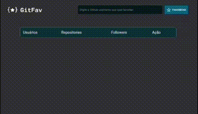

# Git-Favorites

Esse projeto tem o obejtivo de criar uma lista de favoritos de usuários do Github. Para isso, foi utilizado o API do Github, com informações como nome do usuário, login, número de repositórios e  número de seguidores. 

## Demonstração

<h1 align="center">
  
 </h1>

## Aprendizados

Neste projeto utilizei conceitos de Programação Orientada a objetos (POO), trabalhando com classes e heranças no JavaScript. Além disso, utilizei manipulação da DOM, comceitos de imutabilidade, e promises (com fetch, async e await). Outro ponto, foi o conhecimento adquirido sobre o LocalStorage. 

## 🛠 Habilidades
- Javascript 
- HTML
- CSS
- API Github
- Versionamento com Github

## 🔗 Links

